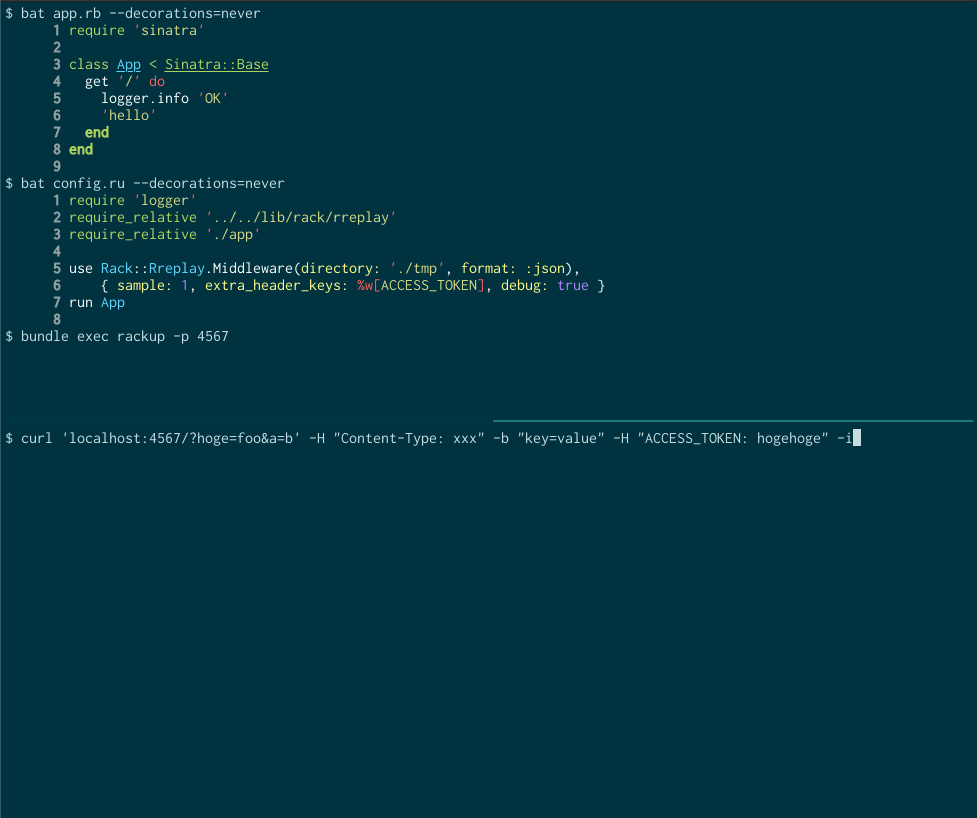
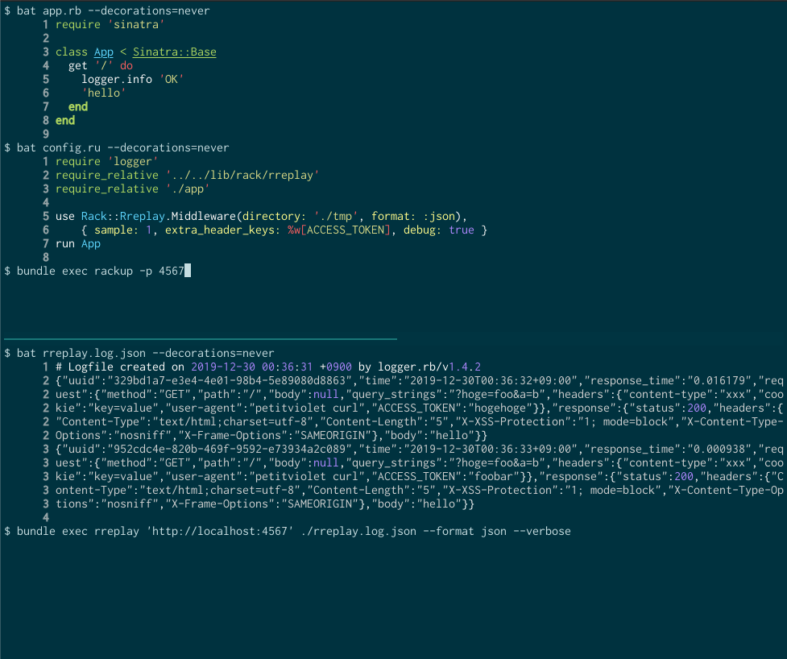

# Rreplay

Replay HTTP request and is able to assert if the response is expected.

- Record HTTP request and response into file
- Feed the recorded request and response

## Installation

Add this line to your application's Gemfile:

```ruby
gem 'rreplay'
```

And then execute:

    $ bundle install

Or install it yourself as:

    $ gem install rreplay

## Usage

### HTTP request/resopnse recording

Use `Rack::Rreplay`.

In 'config.ru' file:

```ruby
require 'rack/rreplay'
use Rack::Rreplay.Middleware(directory: './rreplay_tmp', format: :json),
    { sample: 5, extra_header_keys: %w[ACCESS_TOKEN], debug: true }
```

This configuration enables rreplay to record HTTP request and response, and write records into `./rreplay_tmp` directory files with specified format(json or msgpack).

Please see the implementation of [rack/rreplay.rb](https://github.com/petitviolet/rreplay/blob/master/lib/rack/rreplay.rb).



### HTTP request replay

Use `bundle exec rreplay <endpoint> <target>` to send recorded HTTP request in <target> to <endpoint>.

```console
$ bundle exec rreplay 'http://localhost:4567' ./rreplay_tmp/ --format json --verbose
$ bundle exec rreplay 'https://example.com' ./rreplay_tmp/rreplay.log.msgpack --format msgpack
```

Please call `bundle exec rreplay --help` to see arguments and available options.



## Development

After checking out the repo, run `bin/setup` to install dependencies. Then, run `rake test` to run the tests. You can also run `bin/console` for an interactive prompt that will allow you to experiment.

To install this gem onto your local machine, run `bundle exec rake install`. To release a new version, update the version number in `version.rb`, and then run `bundle exec rake release`, which will create a git tag for the version, push git commits and tags, and push the `.gem` file to [rubygems.org](https://rubygems.org).

## Contributing

Bug reports and pull requests are welcome on GitHub at https://github.com/petitviolet/rreplay. This project is intended to be a safe, welcoming space for collaboration, and contributors are expected to adhere to the [code of conduct](https://github.com/petitviolet/rreplay/blob/master/CODE_OF_CONDUCT.md).


## License

The gem is available as open source under the terms of the [MIT License](https://opensource.org/licenses/MIT).

## Code of Conduct

Everyone interacting in the Rreplay project's codebases, issue trackers, chat rooms and mailing lists is expected to follow the [code of conduct](https://github.com/petitviolet/rreplay/blob/master/CODE_OF_CONDUCT.md).
